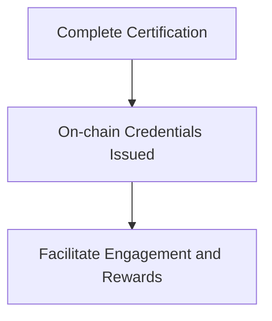
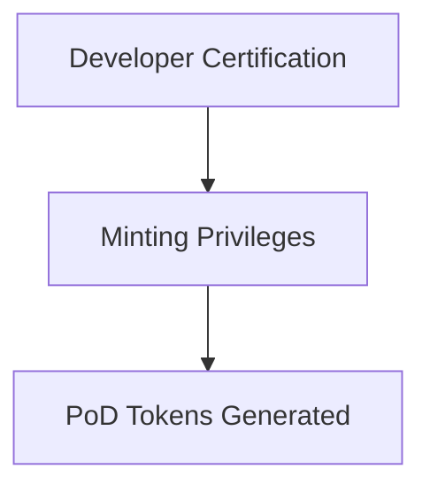
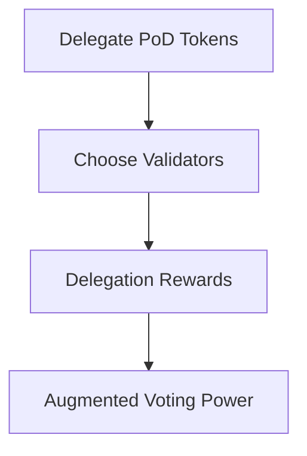
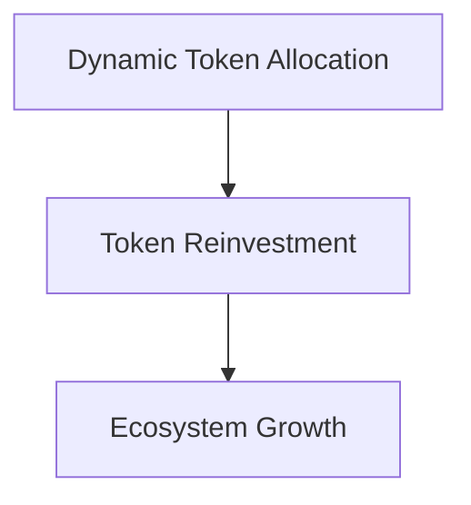
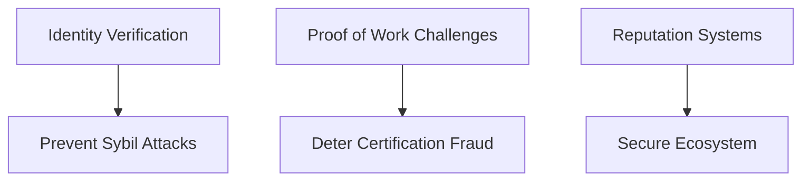

# Proof of Developers Quick⚡Paper : Novel Blockchain Reward and ReStaking Mechanic
### Authored by [@DmikeyAnderson](https://twitter.com/dmikeyanderson)

> a Quick⚡Paper is an easy to read, easy to digest white paper. let's change how lite papers are written, so they can be read quickly, and easily.

## Abstract
Proof of Developers (PoD) introduces an innovative blockchain reward mechanic and staking protocol, designed to incentivize and acknowledge developers' skills in Web3 development practices. This technical exploration delves into the complexities of PoD, covering certification processes, on-chain credentials, unique minting mechanisms, delegation dynamics, validator augmentation, commission structures, and the overall ecosystem architecture.

## Introduction
As the blockchain environment rapidly evolves, there is a growing demand for developers proficient in Web3 technologies. PoD addresses this need by nurturing a dynamic ecosystem that rewards developers for their expertise, fostering collaboration and enhancing blockchain security. Operating on the Ethereum blockchain, PoD presents a decentralized restacking contract model, focusing on certification programs, delegation dynamics, and validator enhancement to promote sustainable ecosystem growth.

## Certification and On-chain Credentials
### Traditional Certification Programs
PoD assimilates conventional certification programs tailored for Web3 development, evaluating developers' skills in smart contract programming, dApp creation, blockchain architecture, and security protocols.

### On-chain Credentials
Developers earn cryptographically secured on-chain credentials upon completing certification programs. These credentials, stored on the Ethereum blockchain, are immutable evidence of a developer's expertise within the PoD ecosystem, facilitating reward mechanisms and active engagement.

## Special Minting for Certified Developers
### Minting Privileges
Certified developers are granted exclusive minting rights linked to their on-chain credentials, allowing them to create PoD tokens essential for staking, delegation, and governance activities.

### Smart Contracts and Minting Logic
The minting process is managed through smart contracts on the Ethereum blockchain, which uphold minting regulations, validate developers' credentials, and enable the generation of PoD tokens based on certification levels and accomplishments.

## Delegation and Staking Dynamics
### Delegating PoD Tokens
Developers can delegate their PoD tokens to entities or validators on the Ethereum blockchain, with the flexibility to change delegation targets based on strategic decisions and preferences.

### Delegation Rewards
Developers delegating PoD tokens are eligible for rewards, determined by the operational performance of the chosen validators or organizations, including their contributions to governance, ecosystem development, and maintaining blockchain security.

## Validator Augmentation and Commission
### Operating as Validators
Entities in the PoD ecosystem can act as validators on the Ethereum blockchain, essential for transaction processing, blockchain security, and governance participation.

### Augmented Voting Power
Validators gain increased voting power through delegated PoD tokens, influencing governance decisions, protocol enhancements, and resource distribution.

### Commission Structures
Validators earn commissions from the delegation and certification activities of developers, proportional to the PoD tokens allocated to them, incentivizing maintenance of high-performance infrastructure and active ecosystem development.

## Restocking Contract Mechanism
### Dynamic Token Allocation
The PoD ecosystem features a restocking contract that dynamically allocates PoD tokens based on certification results, delegation actions, and validator inputs, ensuring equitable and efficient reward distribution while motivating engagement and growth.

### Token Reinvestment
A portion of the rewards from developer certifications, delegation, and validator commissions is automatically reinvested into the ecosystem, bolstering its strength, funding development projects, and securing long-term sustainability.

## Ecosystem Implications
### Sustainability and Growth
The restocking mechanism promotes the sustainability and expansion of the PoD ecosystem, continuously replenishing token reserves, ensuring economic stability, and stimulating active participation from developers, organizations, and validators.

### Incentivized Engagement
The transparent and predictable reward distribution mechanism encourages active involvement from developers, organizations, and validators, driving collaboration, innovation, and the expansion of the ecosystem.

## Potential Abuse and Sybil Attacks
### Delegation Manipulation
Abuse in the PoD ecosystem could occur through the manipulation of delegation mechanisms, with bad actors creating multiple accounts to inflate their rewards and influence.

### Certification Fraud
There is also a risk of certification fraud, where developers might use unethical means to gain certifications, accessing minting privileges and rewards illicitly.

## Strategies for Resistance
### Identity Verification
Implementing stringent identity verification processes can help prevent Sybil attacks and delegation manipulation, ensuring a secure and trustworthy ecosystem.

### Proof of Work (PoW) Challenges
Incorporating Proof of Work (PoW) challenges in the certification process can deter fraudulent activities, requiring developers to demonstrate their real skills and knowledge.

### Reputation Systems
A reputation system, based on developers’ contributions and feedback, can further secure the ecosystem, rewarding high-reputation entities and penalizing low-reputation ones for improved ecosystem integrity.
